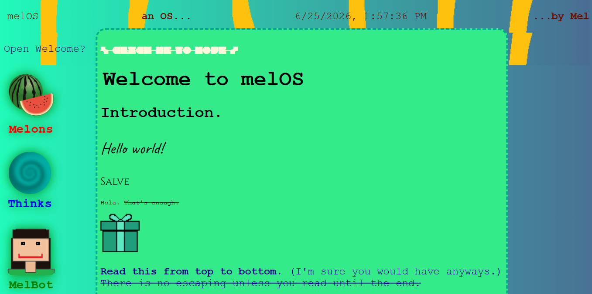
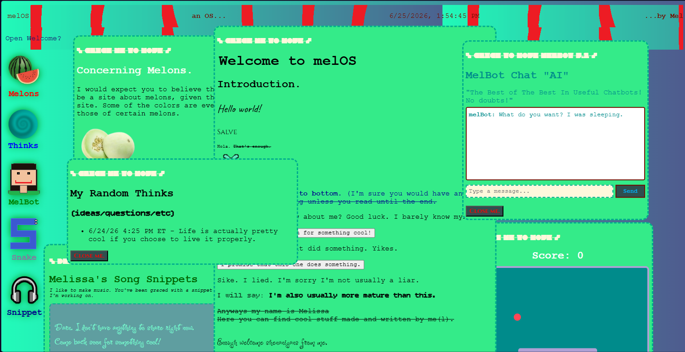

# melOS
A goofy little OS where you can see into my mind and creations. 

Try it here:
https://mel-cruz.github.io/melOS/

* There are 5 "apps" that you can open:
    * Melons - a fun little disclaimer written by me
    * Thinks - a place where I can share my random thoughts and deep psychological questions. 
    * Melbot - a fake AI chatbot which only gives pre-written semi-sarcastic replies every time.
    * Snake - A simple snake clone (also made by me)
    * Snippet - a page where I can share pieces of music I'm working on.

For this project, I relied heavily on the Hackclub WebOS tutorial, Google Fonts (to stylize the website and make it my own), my own artwork, and certain royalty free images (for the fruits and headphones pictures). 
